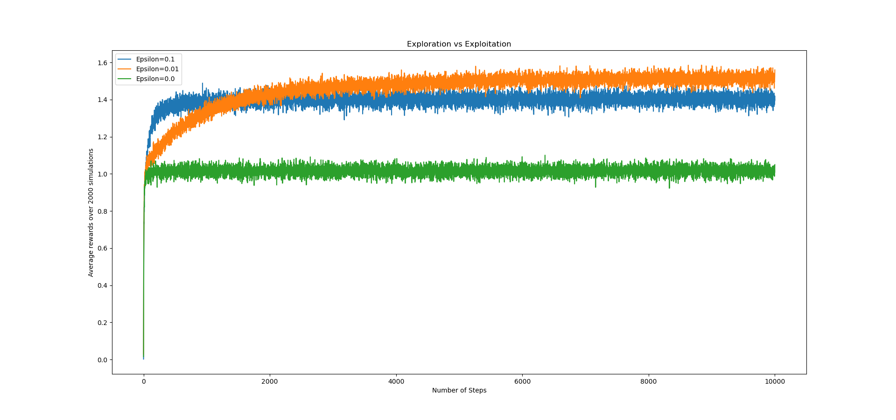
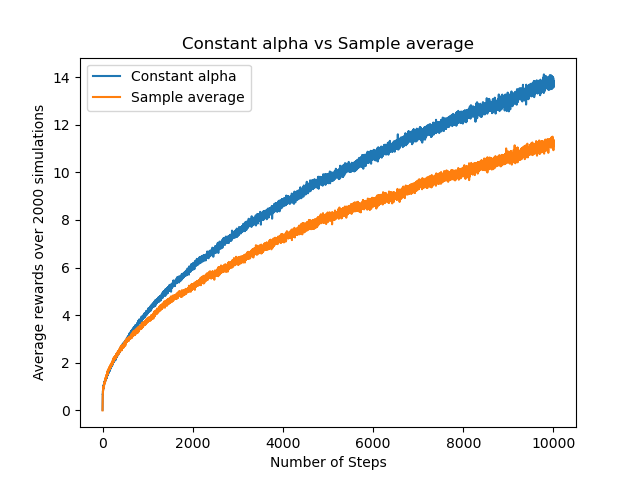
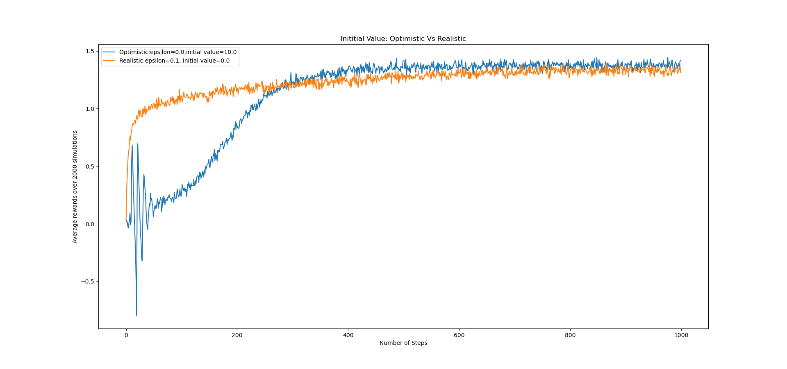
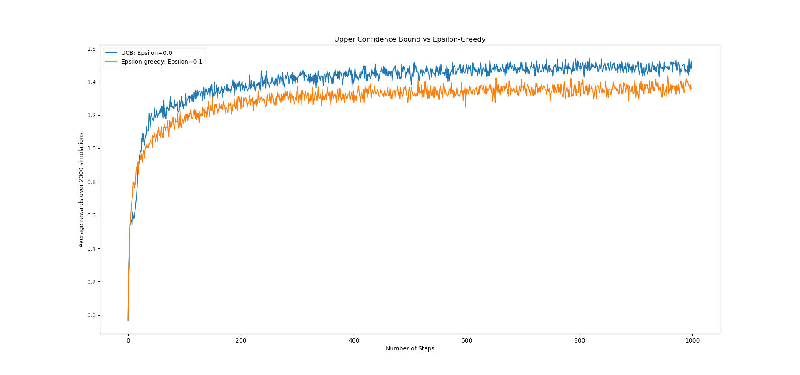

# Reinforcement Learning: Multi-Arm Bandit

### Getting Started

#### Installation

```bash
$ conda env create -f environment.yml
$ conda activate bandits
```

#### General Usage

```python
(bandits) ~/MultiArmBandit$ python
>>> from src import *
>>> plot_epsilon_greedy()
>>> plot_nonstationary()
>>> plot_optimistic_initial_value()
>>> plot_upper_confidence_bound()
```

### Exploration vs Exploitation: changing the value of epsilon  
    


`plot_epsilon_greedy()` 

1000 steps


`plot_epsilon_greedy(10000)`  
10000 steps




---
### Non-stationary reward

`plot_nonstationary()` 




---
### Optimistic initial value
`plot_optimistic_initial_value()`  



---
### Upper Confidence Bound

`plot_upper_confidence_bound()`


